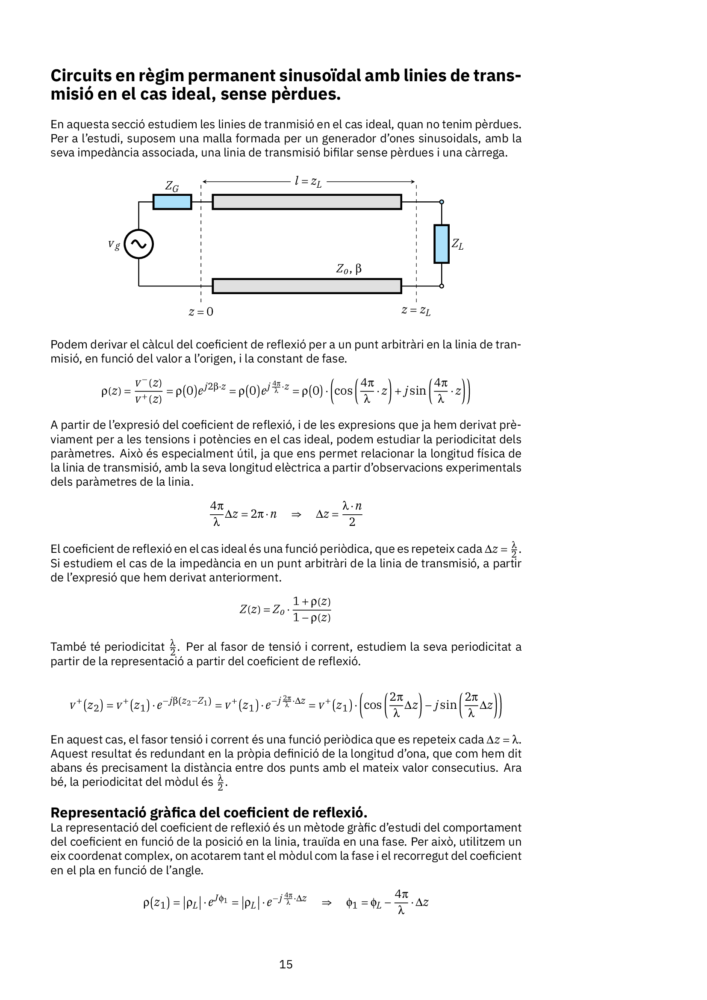
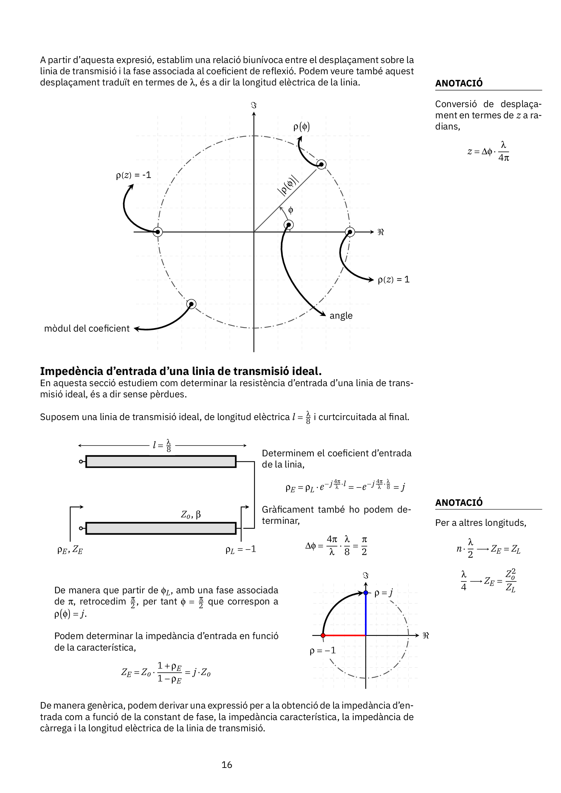
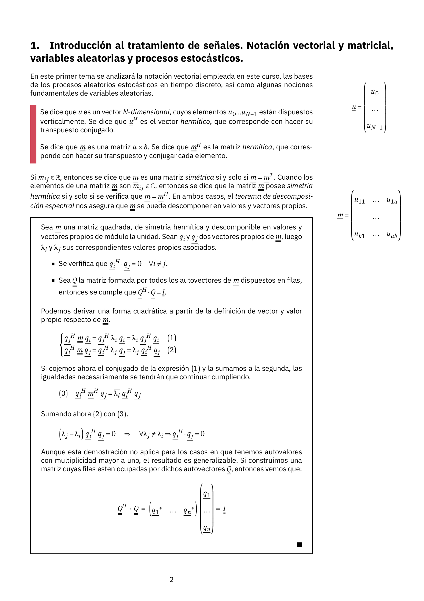
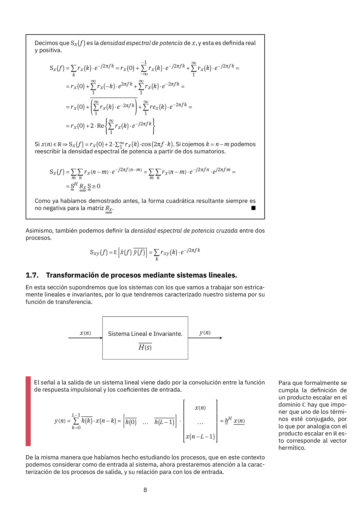
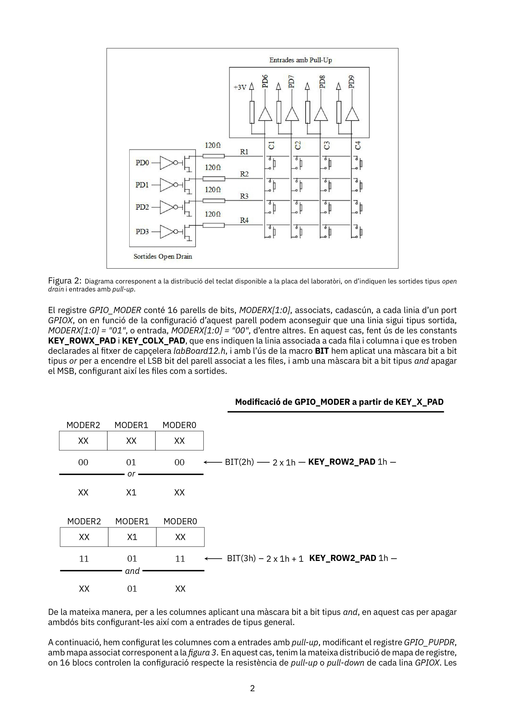
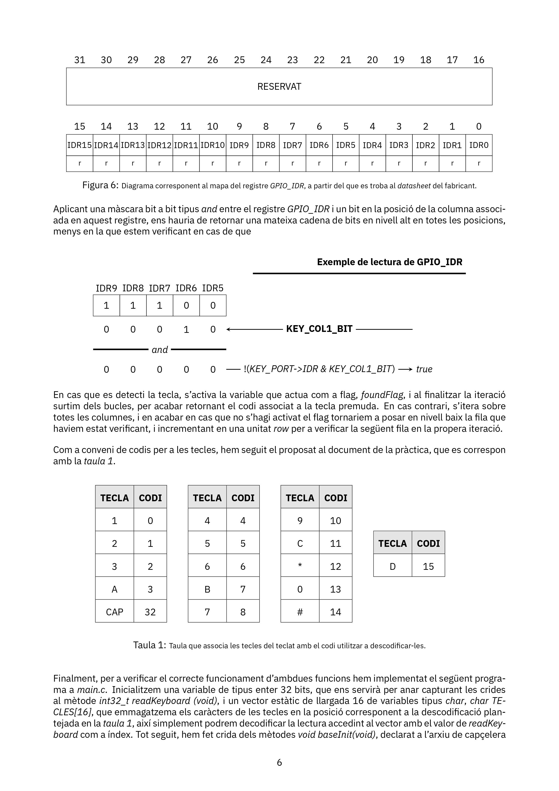

# Portfolio LaTeX
Bienvenido sea lector a mi portfolio de LaTeX. A continuación, encontrará un breve recorrido través de mi experiencia produciendo documentos formateados utilizando LaTeX.

## Notas y apuntes de clase
En esta sección encontrará algunas de mis propuestas a plantillas, sencillas pero de utilidad, para la redacción de notas de clase en asignaturas con volúmen de carga físico-matemática. 

<p align="center">


</p>

<p align="center">


</p>

La fuente utilizada en la mayoría de mis producciones es una configuración de <i>IBM Plex Sans</i>, basada en las aportaciones del usuario <i></i> en <a href="">Stack Overflow</a>.

```TeX
% FONT CONFIGURATION
%%%%%%%%%%%%%%%%%%%%%%%%%%%%%%%%%%%%%%%%%%%%%%%%%%%%%%
\usepackage{fourier}
\usepackage{plex-serif}
\usepackage[basic,italic,symbolgreek]{mathastext}
\usepackage[sfdefault]{plex-sans}

\makeatletter
\@for\@tempa:=a,b,c,d,e,h,i,k,l,m,n,o,q,r,s,t,u,v,w,x\do{
\MTsetmathskips{\@tempa}{0.5mu}{0.5mu}}
\makeatother

\MTsetmathskips{f}{2.5mu}{0.5mu}
\MTsetmathskips{g}{1.5mu}{0.5mu}
\MTsetmathskips{j}{2.5mu}{0.5mu}
\MTsetmathskips{p}{1.5mu}{0mu}
\MTsetmathskips{y}{1.5mu}{0.5mu}
\MTsetmathskips{z}{1mu}{0.5mu}
```

Las plantillas para la toma de apuntes en clase parten de una filosofia concreta de diseño, en la que centrar el contenido en el 80% de la página, reservando una columna lateral para anotaciones y pequeñas figuras que completan los apuntes. Para ello, se configuran las páginas a partir del paquete <i>geometry</i> para añadir el suficiente margen en el extremo derecho, y el paquete <i>marginnote</i> para añadir dichas anotaciones.

```TeX
\documentclass[fleqn]{article}
\usepackage{geometry}
\geometry{
a4paper,
marginparwidth=75pt,
total={170mm,257mm},
left=15mm,
right=55mm,
top=20mm,
marginparsep=8mm,
marginparwidth=4cm
}

\input{preamble}
```

Para la manipulación de la notación vectorial, se ha incluído nuevas macros que permiten generar la 

```TeX
% MATRIX AND VECTOR NOTATION CONFIG
%%%%%%%%%%%%%%%%%%%%%%%%%%%%%%%%%%%%%%%%%%%%%%%%%%%%%%

\makeatletter
% overline
\newcommand{\dbloverline}[1]{\overline{\dbl@overline{#1}}}
\newcommand{\dbl@overline}[1]{\mathpalette\dbl@@overline{#1}}
\newcommand{\dbl@@overline}[2]{%
  \begingroup
  \sbox\z@{$\m@th#1\overline{#2}$}%
  \ht\z@=\dimexpr\ht\z@-2\dbl@adjust{#1}\relax
  \box\z@
  \ifx#1\scriptstyle\kern-\scriptspace\else
  \ifx#1\scriptscriptstyle\kern-\scriptspace\fi\fi
  \endgroup
}
% underline
\newcommand{\dblunderline}[1]{\@@underline{\dbl@underline{#1}}}
\newcommand{\dbl@underline}[1]{\mathpalette\dbl@@underline{#1}}
\newcommand{\dbl@@underline}[2]{%
  \begingroup
  \sbox\z@{$\m@th#1\@@underline{#2}$}%
  \dp\z@=\dimexpr\dp\z@-2\dbl@adjust{#1}\relax
  \box\z@
  \ifx#1\scriptstyle\kern-\scriptspace\else
  \ifx#1\scriptscriptstyle\kern-\scriptspace\fi\fi
  \endgroup
}
\newcommand{\dbl@adjust}[1]{%
  \fontdimen8
  \ifx#1\displaystyle\textfont\else
  \ifx#1\textstyle\textfont\else
  \ifx#1\scriptstyle\scriptfont\else
  \scriptscriptfont\fi\fi\fi 3
}
\makeatother

% vectors and matrices
\renewcommand{\vec}[1]{{%
  \mspace{0.5mu}%
  \underline{\mspace{-0.5mu}#1\kern-\scriptspace\mspace{-0.5mu}}%
  \mspace{0.5mu}%
}}
\newcommand{\mat}[1]{{%
  \mspace{0.5mu}%
  \dblunderline{\mspace{-0.5mu}#1\kern-\scriptspace\mspace{-0.5mu}}%
  \mspace{0.5mu}%
}}
```

Todos los gráficos includios en los documentos han sido producidos íntegramente gracias a <i>TikZ</i>.A continuación se muestran algunos ejemplos más del uso de la libreria aplicados en reportes de laboratorio para la creación de diagramas de soporte. 

<p align="center">


</p>

## Formato de documentos ajedrecísticos
En esta sección podrá consultar algunos ejemplos de los documentos producidos por un servidor para las clases impartidas en el <i>Club d'Escacs Mataró</i>, comprendiendo desde fichas hasta extractos de la redacción de algún curso.

<p align="center">


</p>

<p align="center">


</p>

Los documentos estan formateados de acuerdo con la tradición en la produción bibliográfica en el mundo del ajedrez, dividiendo el folio en dos cómodas columnas en las que se disponen tanto comentarios, como diagramas y notación algebraica. Para la manipulación de los símbolos ajedrecísticos, piezas y notación en comentarios, he utilizado el paquete <i>xskak</i>.

IMAGEN

De la misma manera para renderizar los diagramas, que a partir del propio paquete pueden ser generados utilizando notación FEN, o bien la secuencia de partida que se va registrando a lo largo del documento a partir de <i>\mainline{ }</i>.

IMAGEN

Los títulos 