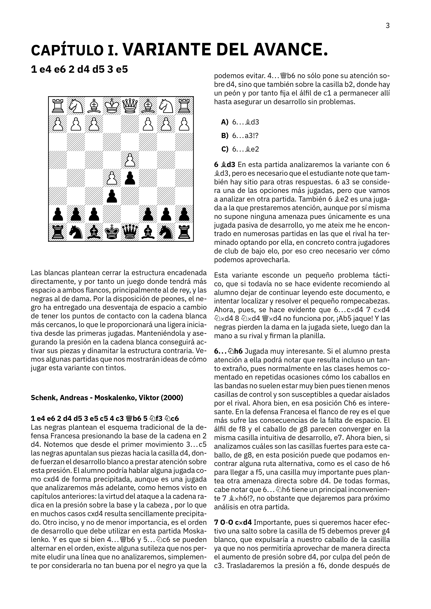
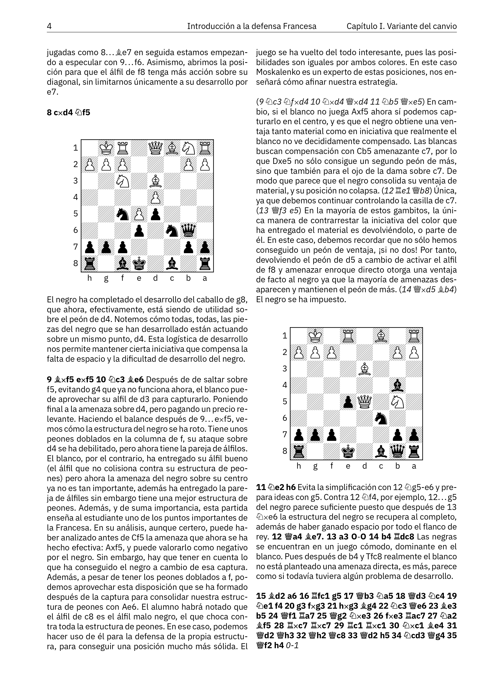
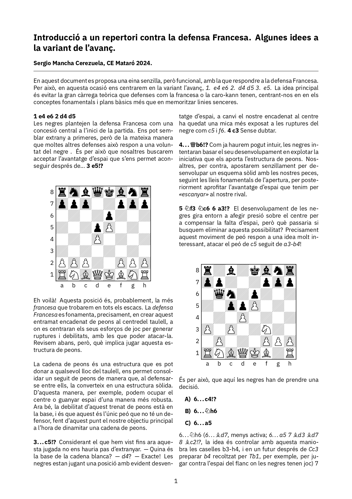
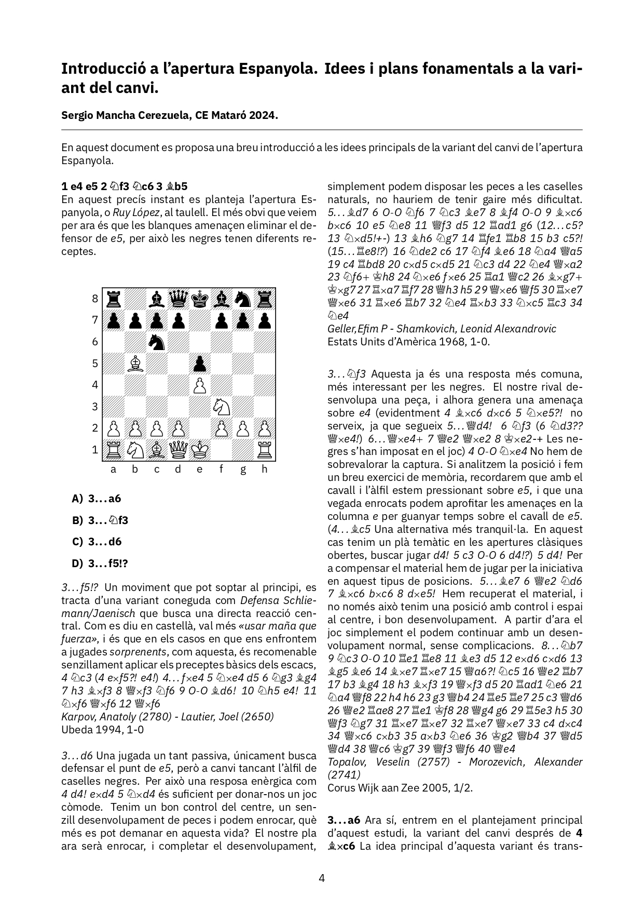

# Portfolio LaTeX
Bienvenido sea lector a mi portfolio de LaTeX. A continuación, encontrará un breve recorrido través de mi experiencia produciendo documentos formateados utilizando LaTeX.

## Notas y apuntes de clase
En esta sección encontrará algunas de mis propuestas a plantillas, sencillas pero de utilidad, para la redacción de notas de clase en asignaturas con volúmen de carga físico-matemática. 

## Formato de documentos ajedrecísticos
En esta sección podrá consultar algunos ejemplos de los documentos producidos por un servidor para las clases impartidas en el <i>Club d'Escacs Mataró</i>, comprendiendo desde fichas hasta extractos de la redacción de algún curso.

